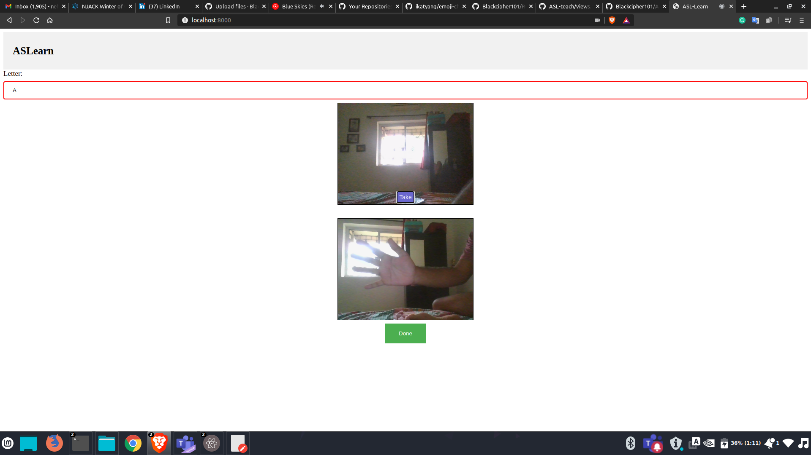

# ASL-teach :teacher:

Sign Language :open_hands: is amazing skill to have it allows you to communicate with people irrespective thier abilites to speak and hear:ear_with_hearing_aid:. Leading to 
a more inclusive society. The inspritation 	:bulb: came to me when I saw on the news the celebrartation of "The week of the Deaf and Dumb". 
So this is bacically planning this for teaching society Sign language.

## Setup :wrench:
```
git clone https://github.com/Blackcipher101/ASL-teach.git

pip install opencv-python

pip install Django

```

### To start 	:old_key:
You might have to head up too <a href="https://github.com/Blackcipher101/Heroku-ASL">Heroku-ASL</a> set ip up or make slight change in <a href='https://github.com/Blackcipher101/ASL-teach/blob/master/ASL_Learn/views.py'>views.py </a>
change the link to ```https://asldetect.heroku.app//predict?```

PS: For me heroku didn't work as the model is pretty big :cry: to make changes to the model head out to <a href="https://github.com/Blackcipher101/ASL-detector">ASL-detector</a>
So set it up locally

```pyhton manage.py runserver localhost:8000```

:partying_face: Voila!!	:partying_face:
## Work flow :hourglass_flowing_sand:
Go to localhost:8000 on your favroite browser:computer: 
Choose a letter -> Take a photo :camera: -> check :heavy_check_mark:-> master:crossed_swords:	 :partying_face:

# Demo



